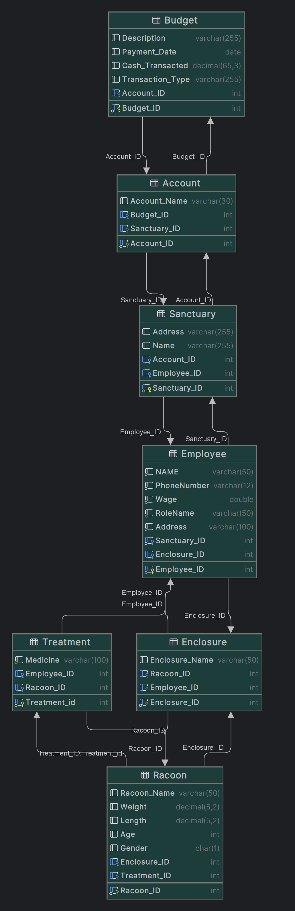

# Racoon City Sanctuary - Database Design
***
## Project Description
We plan to design a database for a raccoon sanctuary. We plan to keep track of general employee information, business expenses, and the money we bring in with donations on certain days. 
We also will track what tasks need to be performed and what time they need to be performed.  We will keep track of general information about our enclosures, like how many raccoons live in the enclosure, the name of the enclosure, and the enclosure's ID. 
In addition, we plan to keep track of the raccoons in our sanctuary and provide general information about them, like their name, weight, length, and what enclosure they live in—finally, general medical history and treatment of the raccoons.

# To Build the Database
First be sure to have docker installed or start up a standalone instance of mysql on your machine.
For Docker, navigate to the root directory of the project and run the following command:
```BASH
docker-compose up -d
```
You may now access the DB using your favorite DB editor using the host 127.0.0.1 port 4040 and user root with password 
also being root.
- Now, run all files named `create_<table name>_table.sql`.
- After all tables are created run all files named `alter_<table 1>_<table 2>_relationship.sql`.
- Finally, run all files named `insert_into_<table name>_table.sql`.

You are now ready to run any of the visualization queries you would need.


# ER Diagram


# SQL Queries

***
## Account Table
#### [Table Creation](Account/create_account_table.sql)
#### [Account->Budget Relationship Creation](Account/alter_account_budget_relationship.sql)
#### [Account->Sanctuary Relationship Creation](Account/alter_account_sanctuary_relationship.sql)
#### [Data Insertion](Account/insert_into_account_table.sql)
#### [Data Insertion](Account/insert_into_account_table.sql)
***
## Budget Table
#### [Table Creation](Budget/create_budget_table.sql)
#### [Budget->Account Relationship Creation](Budget/alter_budget_account_relationship.sql)
#### [Data Insertion](Budget/insert_into_budget_table.sql)
*** 
## Employee Table
#### [Table Creation](Employee/create_employee_table.sql)
#### [Employee->Enclosure Relationship Creation](Employee/alter_table_employee_enclosure_relationship.sql)
#### [Employee->Sanctuary Relationship Creation](Employee/alter_table_employee_sanctuary_relationship.sql)
#### [Data Insertion](Employee/insert_into_employee_table.sql)
***
## Enclosure Table
#### [Table Creation](Enclosure/create_enclosure_table.sql)
#### [Enclosure->Employee Relationship Creation](Enclosure/alter_table_enclosure_employee_relationship.sql)
#### [Enclosure->Racoon Relationship Creation](Enclosure/alter_table_enclosure_raccoon_relationship.sql)
#### [Data Insertion](Enclosure/insert_into_enclosure_table.sql)
***
## Raccoon Table
#### [Table Creation](Raccoon/create_raccoon_table.sql)
#### [Raccoon->Enclosure Relationship Creation](Raccoon/alter_table_raccoon_enclosure_relationship.sql)
#### [Raccoon->Treatment Relationship Creation](Raccoon/alter_table_raccoon_treatment_relationship.sql)
#### [Data Insertion](Raccoon/insert_into_raccoon_table.sql)
***
## Sanctuary Table
#### [Table Creation](Sanctuary/create_sanctuary_table.sql)
#### [Sanctuary->Account Relationship Creation](Sanctuary/alter_table_sanctuary_account_relationship.sql)
#### [Sanctuary->Employee Relationship Creation](Sanctuary/alter_table_sanctuary_employee_relationship.sql)
#### [Data Insertion](Sanctuary/insert_into_sanctuary_table.sql)
***
## Shift Table
#### [Table Creation](Shift/create_shift_table.sql)
#### [Shift->Employee Relationship Creation](Shift/alter_table_shift_employee_relationship.sql)
#### [Shift->Task Relationship Creation](Shift/alter_table_shift_task_relationship.sql)
#### [Data Insertion](Shift/insert_into_shift_table.sql)
***
## Task Table
#### [Table Creation](Task/create_task_table.sql)
#### [Task->Shift Relationship Creation](Task/alter_table_task_shift_relationship.sql)
#### [Data Insertion](Task/insert_into_task_table.sql)
***
## Treatment Table
#### [Table Creation](Treatment/create_treatment_table.sql)
#### [Treatment->Employee Relationship Table](Treatment/alter_table_treatment_employee_relationship.sql)
#### [Treatment->Racoon Relationship Table](Treatment/alter_table_treatment_raccoon_relationship.sql)
#### [Data Insertion](Treatment/insert_into_treatment_table.sql)