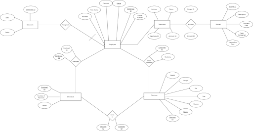

# Racoon City Sanctuary - Database Design
***
## Project Description
We plan to design a database for a raccoon sanctuary. We plan to keep track of general employee information, business expenses, and the money we bring in with donations on certain days. 
We also will track what tasks need to be performed and what time they need to be performed.  We will keep track of general information about our enclosures, like how many raccoons live in the enclosure, the name of the enclosure, and the enclosure's ID. 
In addition, we plan to keep track of the raccoons in our sanctuary and provide general information about them, like their name, weight, length, and what enclosure they live in—finally, general medical history and treatment of the raccoons.

# ER Diagram

# SQL Queries

***
## Account Table
#### [Table Creation](Account/create_account_table.sql)
#### [Account->Budget Relationship Creation](Account/alter_account_budget_relationship.sql)
#### [Account->Sanctuary Relationship Creation](Account/alter_account_sanctuary_relationship.sql)
#### [Data Insertion](Account/insert_into_account_table.sql)
#### [Data Insertion](Account/insert_into_account_table.sql)
***
## Budget Table
#### [Table Creation](Budget/create_budget_table.sql)
#### [Relationship Creation](Budget/alter_budget_account_relationship.sql)
#### [Data Insertion](Budget/insert_into_budget_table.sql)
*** 
## Employee Table
#### [Table Creation](Employee/create_employee_table.sql)
#### [Data Insertion](Employee/insert_into_employee_table.sql)
***
## Enclosure Table
#### [Table Creation](Enclosure/create_enclosure_table.sql)
#### [Data Insertion](Enclosure/insert_into_enclosure_table.sql)
***
## Lives_In Table
#### [Table Creation](Lives_In/create_lives_in_table.sql)
#### [Data Insertion](Lives_In/insert_into_lives_in_table.sql)
***
## Manages Table
#### [Table Creation](Manages/create_manages_table.sql)
#### [Data Insertion](Manages/insert_into_manages_table.sql)
***
## Racoon Table
#### [Table Creation](Racoon/create_racoon_table.sql)
#### [Data Insertion](Racoon/insert_into_racoon_table.sql)
***
## Sanctuary Table
#### [Table Creation](Sanctuary/create_sanctuary_table.sql)
#### [Data Insertion](Sanctuary/insert_into_sanctuary_table.sql)
***
## Schedule Table
#### [Table Creation](Schedule/create_schedule_table.sql)
#### [Data Insertion](Schedule/insert_into_schedule_table.sql)
***
## Treatment Table
#### [Table Creation](Treatment/create_treatment_table.sql)
#### [Data Insertion](Treatment/insert_into_treatment_table.sql)