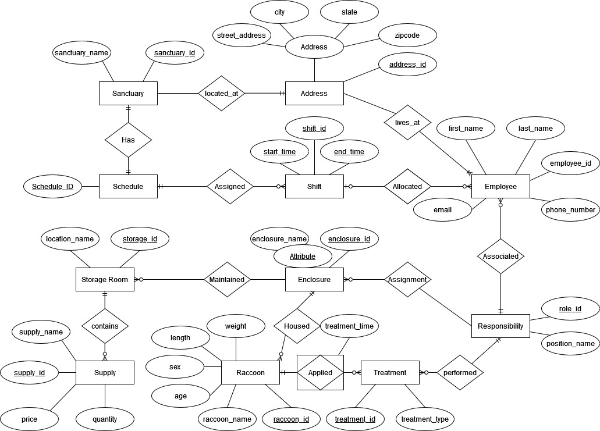
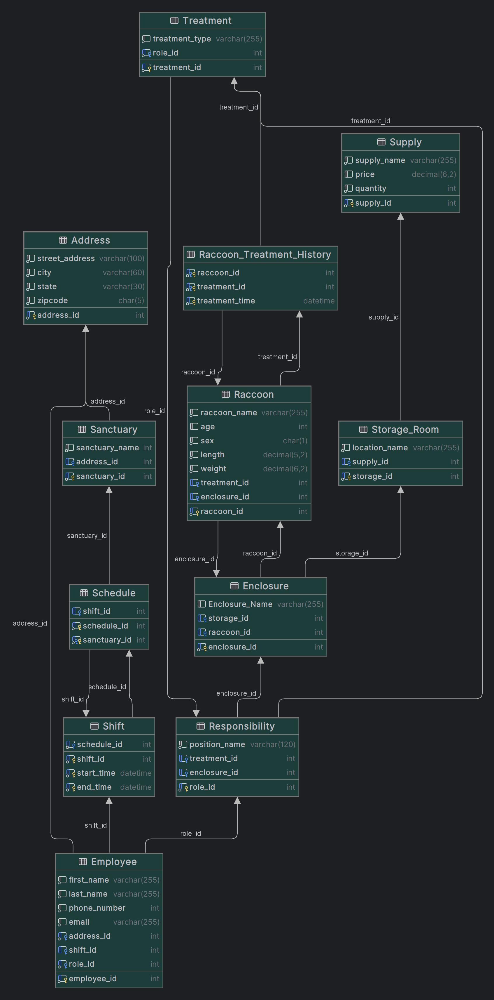

# Racoon City Sanctuary - Database Design
***
## Project Description
We plan to design a database for a nonprofit organization that operates multiple raccoon sanctuaries across the US. 
Their need is to better manage their employee scheduling and responsibilities, track raccoon location on the sanctuary 
and treatment history, and the supplies that are available for each enclosure on the sanctuary.

# To build the Frontend
The frontend is build using Laravel, a PHP framework. To run the project locally simply ensure you device has PHP 8.3, a nginx configuration, and you have Laravel installed.
- My recommendation would be to download Laravel Heard as it provides you will all of these resources in a matter of seconds and is one of the easiest ways to set up.
- Once you have laravel installed, either run the PHP artisan serve command or if you are using Heard, install the repository in the ~/Heard folder and instantly find the website in your browser at http://sanctuary_app.test. Now that you have access to the website you want to make sure the database server is up and running. 

`docker-compose up -d`

Reminder: update you .env file as this is not shared via git The default configuratoin if you use the same docker setup as listed below is the following configuration
```.ENV
DB_CONNECTION=mysql
DB_HOST=127.0.0.1
DB_PORT=4040
DB_DATABASE=raccoon_sanctuary
DB_USERNAME=root
DB_PASSWORD=root
```

The database will likely be empty on your machine. Either run the PHP artisan migrate command or import the provided .mysql dump file to rebuild the DB.


# To Build the Database
First be sure to have docker installed or start up a standalone instance of mysql on your machine.
For Docker, navigate to the root directory of the project and run the following command:

```BASH
docker-compose up -d
```

The best method will be to use the mysql dump to rebuild the database.

Alternatively you can run:

You may now access the DB using your favorite DB editor using the host 127.0.0.1 port 4040 and user root with password 
also being root.
- Now, run all files named `create_<table name>_table.sql`.
- After all tables are created run all files named `alter_<table 1>_<table 2>_relationship.sql`.
- Finally, run all files named `insert_into_<table name>_table.sql`.

You are now ready to run any of the visualization queries you would need.

# ER Diagram


# Schema Diagram


# SQL Queries

***
## Address Table
#### [Table Creation](Address/create_address_table.sql)
#### [Data Insertion](Address/insert_into_address_table.sql)
***
## Employee Table
#### [Table Creation](Employee/create_employee_table.sql)
#### [Relationship Creation](Employee/alter_employee_relationships.sql)
#### [Data Insertion](Employee/insert_into_employee_table.sql)
***
## Enclosure Table
#### [Table Creation](Enclosure/create_enclosure_table.sql)
#### [Relationship Creation](Enclosure/alter_enclosure_relationships.sql)
#### [Data Insertion](Enclosure/insert_into_enclosure_table.sql)
***
## Raccoon Table
#### [Table Creation](Raccoon/create_raccoon_table.sql)
#### [Relationship Creation](Raccoon/alter_raccoon_relationships.sql)
#### [Data Insertion](Raccoon/insert_into_raccoon_table.sql)
***
## Responsibility
#### [Table Creation](Responsibility/create_responsibility_table.sql)
#### [Relationship Creation](Responsibility/alter_responsibility_relationships.sql)
***
## Raccoon Treatment History Table
#### [Table Creation](Raccoon_Treatment_History/create_raccoon_treatment_history_table.sql)
***
## Sanctuary Table
#### [Table Creation](Sanctuary/create_sanctuary_table.sql)
#### [Sanctuary->Account Relationship Creation](Sanctuary/alter_sanctuary_relationships.sql)
#### [Data Insertion](Sanctuary/insert_into_sanctuary_table.sql)
***
## Schedule Table
#### [Schedule Creation](Schedule/create_schedule_table.sql)
#### [Relationship Creation](Schedule/alter_schedule_relationships.sql)
***
## Shift Table
#### [Table Creation](Shift/create_shift_table.sql)
#### [Relationship Creation](Shift/alter_shift_relationships.sql)
#### [Data Insertion](Shift/insert_into_shift_table.sql)
***
## Storage Room Table
#### [Table Creation](Storage_Room/create_storage_room_table.sql)
#### [Relationship Creation](Storage_Room/alter_storage_room_relationship.sql)
***
## Supply Table
#### [Table Creation](Supply/create_supply_table.sql)
***
## Treatment Table
#### [Table Creation](Treatment/create_treatment_table.sql)
#### [Relationship Table](Treatment/alter_treatment_relationship.sql)
#### [Data Insertion](Treatment/insert_into_treatment_table.sql)